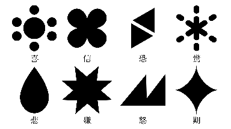
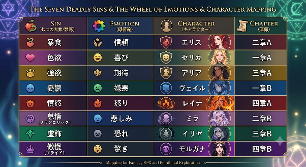

# 03. 感情リソース

## 感情の扱い (設定)

人間の感情は本来つかみどころがなく、内臓のように捉えきれず、気づかないうちに悪くなっている類のもの。
悪性と善性が内包されている。明言はしないが、自死 = 器の許容量を超えた行き過ぎた感情の発露として扱う。

## 8 種の感情リソース

プルチックの基本 8 感情を、見えない内面を「見える・数えられる・賭けられる」コインに変換したもの。
VOID RED に来る前に自分の記憶を引き払っており、それが元手になっている。

| 感情 | 対応する枢要罪 | 強さ (弱 → 強) |
| --- | --- | --- |
| 信頼 | 暴食 | 1 |
| 喜び | 色欲 | 2 |
| 期待 | 強欲 | 3 |
| 嫌悪 | 憂鬱 | 4 |
| 怒り | 憤怒 | 5 |
| 悲しみ | 怠惰 (メランコリック) | 6 |
| 恐れ | 虚飾 | 7 |
| 驚き | 傲慢 (プライド) | 8 |

## 所持と補充

- 各参加者は各階層の開始時に **8 種 × 5 枚 = 40 枚** を所持する。
- 手元に残ったリソースは次の階層へ持ち越せる。各章で規定数まで補充される。
  - そのため階層が進むほど、参加者ごとの所持内訳に差が出る (前階層で温存したキャラは厚い)。

## 消費と増減の意味

- ある感情を賭け続ければその色は枯れていく。
- リソースの増減は「根源的な感情 ↔ ルールに囚われた感情」の揺らぎを可視化する役割を持つ。
- オークションは記憶を集める場であると同時に、**ノアの感情の配合を絶えず再分配する**装置でもある。
- プレイヤーは記憶を競り落としているつもりで、実は**賭け方によってノアの人格そのものを構築している**。

### 枯渇の設定 (実装上の扱いは 02 の人格崩壊を参照)

感情リソースの枯渇は、自らの基本感情を賭しすぎて純粋な感情を失い、根源的な欲だけにまみれた状態を指す。
魂を天秤に見立て、右の器が感情・左の器が罪を司る。感情側が失われると均衡が崩れる。
記憶を取り込む (洗礼) ことで記憶から感情を取り戻し、精算して均衡を戻す、という循環になっている。
