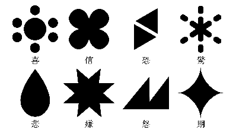
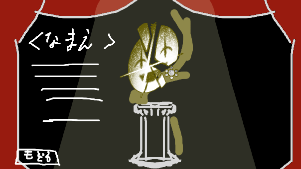

# 04. 記憶 (アーティファクト / ロット)

## 記憶とは

集合的無意識内の空間 VOID RED にプールされた記憶の断片を元に作られたアーティファクトであり、
オークションのロット (出品物)。`ロットNo.3『うまく笑えなかったこと』` のように名称がつく。






## データ構造

| 項目 | 説明 |
| --- | --- |
| No. | `<感情番号>-<連番>` (例: `1-1`) |
| 名称 | 例: 『上手に笑えなかったこと』 |
| フレーバーテキスト | 例: 「ただ人よりちょっと不器用だっただけなんだ。」 |
| 感情属性 | 8 感情のいずれか。歪みの判定基準になる |
| 共鳴値 (レゾナンス) | 0〜100。その階層の記憶テーマとの適合度 |
| デザイン | 個別のビジュアル。隠れミッキー的な記憶のマークが付く |

- 従来の「自己記憶 / 他者記憶」の区別は**廃止**。
  - 代わりに各アーキタイプの過去と取れる記憶が紛れ込んでおり、アチーブメント報酬として
    「喜びに満ちた少女の記憶：〜〜」のようなタイトルで詳細が開示される。

## 記憶テーマと共鳴値

- 各階層に記憶テーマ (選別する記憶のカテゴリ) が設定される。例: 「許したかったもの」。
- 共鳴値はテーマとの合致度。プレイヤーは**数値を直接見ず、名称とフレーバーから推測して入札する**。
- 合致度に加えて「強そうな言葉かどうか」も共鳴値に反映してよい。
  - テーマを深く読まないプレイヤーにも直感的に価値が伝わり、厨二的な手応えも確保できる。
- 収集率に応じて記憶テーマが「鮮明化」する (テーマ文言が置き換わる)。
  - **鮮明化はエンド分岐条件には使わない** (10 参照)。

## 記憶の価値観 (設計思想)

記憶の価値は「関係的」にしか決まらない。
「あの記憶がどれだけ重いか」は固定の絶対値ではなく、誰と比べるか・いつ思い出すか・どこで晒すかで変わり、
記憶の良し悪しも相対評価である。
VOID RED で記憶を感情で値付けし合うのは、記憶の良し悪しを決める行為ではない — これは冒頭で明文化する。

## 歪み

**歪み = その記憶に入札された感情リソースの属性と、記憶自身の感情属性のズレ**。

```
例) 『うまく笑えなかったこと』(属性: 喜び) を 喜び3 + 悲しみ1 で落札
    → 喜び3 は一致、悲しみ1 が不一致 → 歪み +1
```

- 歪みは洗礼 (06) で可視化され、主人公の感情状態に影響する。
- どのタイミングでどの記憶に何を賭け、対話でどう働きかけて歪みを避け、リソースをどうやりくりするか —
  という思考をプレイヤーに強いるための軸。

## 現行の記憶リスト (プレースホルダ多数)

| No. | 名称 | 属性 | フレーバー |
| --- | --- | --- | --- |
| 1-1 | 上手に笑えなかったこと | 喜び | ただ人よりちょっと不器用だっただけなんだ。 |
| 3-1 | ありのままに生きること | 信頼 | 誰かの理想になりたかったわけではないんだ。 |
| 3-2 | あの日救えなかったこと | 信頼 | 正しさだけでは誰かを救えなかったんだ。 |
| 3-3 | 何かを切り捨てたこと | 信頼 | 切り捨ててきたものが道を作ってきたと知っていたんだ。 |
| 5-2 | もがき苦しんだこと | 喜び | 感じた痛みの分だけ誰かの痛みを分かつことができたんだ。 |
| 6-1 | 脆く弱かった本音 | 恐れ | ただずっと嫌われるのが怖かったんだ。 |
| 8-1 | 何もわからなかったこと | 驚き | レールを歩いていた私には自由はありあまったんだ。 |
| 8-2 | 母を優先しなかったこと | 驚き | 信じた結果失ったものの大きさを知らなかったんだ。 |

> 原典では No.2-1 / 4-1 / 5-1 / 7-1 が 1-1 のコピーのまま残っている (未執筆)。
> 共鳴値も全記憶で未設定。プロトタイプではダミー値で進める。
