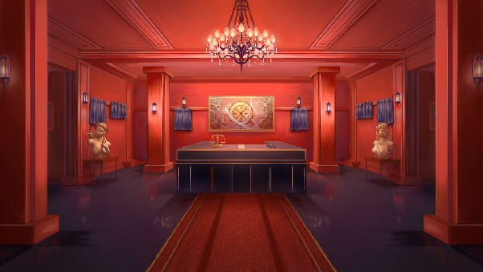
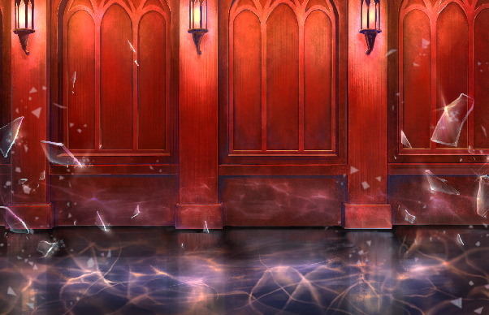
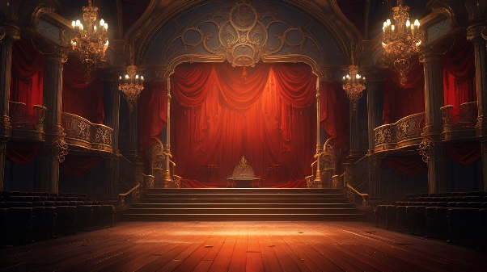
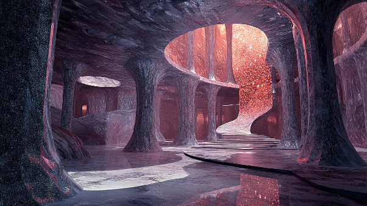
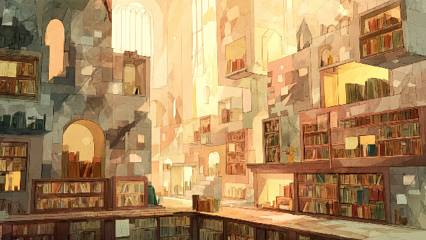
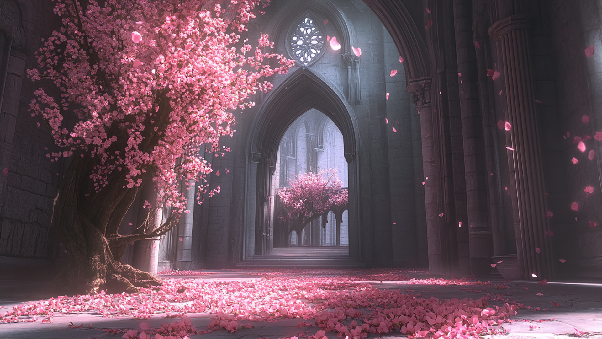
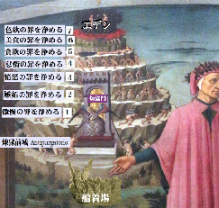

# 08. 階層

## 階層の仕組み

- 各階層で記憶オークションが行われ、記憶を落札した者は「洗礼」を受けて記憶を人格に統合し、次の階層へ進む。
- 最後の階層まで進み、**鍵**を手にした者だけが楽園に行き、自由を得られる。
- 0 階層はチュートリアル会場であると同時に**ロビー**を兼ね、各階層からいつでも行き来できる。
- オークション自体は小グループ制。**前の階層で対戦したキャラとは二度と同じ卓につかない**。

## 階層別テーブル

| 階層 | 参加メンバー (主人公を除く) | 記憶テーマ | 鮮明化後 |
| --- | --- | --- | --- |
| 0 | アルヴ / モブ(喜び) / モブ(悲しみ) / モブ(怒り) | 自己を明らかにすること | 記憶は選び取ることで運命から人格に変わる |
| 1 | セリカ(喜び) / ヴェイル(嫌悪) / モブ(驚き) / モブ(信頼) | 許したかったもの | (保留) |
| 2 | エリス(信頼) / ミラ(悲しみ) / モブ(嫌悪) / モブ(期待) | 諦めたかったもの | (保留) |
| 3 | アリア(期待) / イリヤ(恐れ) / モブ(悲しみ) / モブ(怒り) | 憧れていたもの | (保留) |
| 4 | レイナ(怒り) / モルガナ(驚き) / モブ(恐れ) / モブ(喜び) | 壊したくなかったもの | (保留) |

- 4 階層には**獲得必須の記憶 (楽園への鍵)** が存在する。
- 4 階層のモブにアルヴが紛れている案あり (未確定)。

## 各階層の情景

### 0 階層

アルヴが新規参加者にチュートリアルを行う場所。最下層らしく水底のような重苦しい空気と赤が抑圧された感情を刺激する。
アーティファクトになりきれない記憶の断片が常に形を変えながら揺らめいている。
ロビーとして機能し、VOID RED 内には空腹などの概念がないためオークション前は雑談で時間を潰すしかない。

### 1 階層

チュートリアルを終えた参加者を歓迎するかのような煌びやかな光に溢れた場所。
鏡があたりに浮遊しているが、鏡に映るのは参加者の内なる感情だけ。**愛や軽蔑**に関わる記憶が登場する。

### 2 階層

洗礼を受けて進んだ者への試練の門がそびえる無機質な場所。立ち込める霧の先には無限の奈落。
**服従や後悔**に関わる記憶が登場する。

### 3 階層

楽園への願いを思い描いた膨大な夢物語が書物となり所蔵された場所。壮大な空想に耽溺する参加者も多い。
**楽観や畏敬**に関わる記憶が登場する。

### 4 階層

VOID RED 内で最も「楽園」に近い場所であり、神聖な空気で満ちている。
中央には参加者たちの自己の成熟を象徴する大木が佇む。

## 元ネタ: 煉獄の七つの冠

ダンテ『神曲』の煉獄は、罪を火などで浄めながら山を登り天国 (地上の楽園) へ近づく場。
生前の罪を浄化する七つの冠があり、傲慢が最下層 = 最も重い罪とされる。

| 冠 | 罪 | 罰 |
| --- | --- | --- |
| 第一 | 傲慢 | 重い石を背負い、腰を曲げて歩く |
| 第二 | 嫉妬 | まぶたを縫い合わされ、他者を羨まないようにする |
| 第三 | 憤怒 | 視界を遮る濃い煙の中で過ごす |
| 第四 | 怠惰 | ひたすら休まず走り回る |
| 第五 | 貪欲 | 地面に五体を伏せて欲望を戒める |
| 第六 | 暴食 | 届かない果実と水に耐え、食欲を節制する |
| 第七 | 愛欲・色欲 | 激しい炎の中を通り抜けて情欲を清める |
